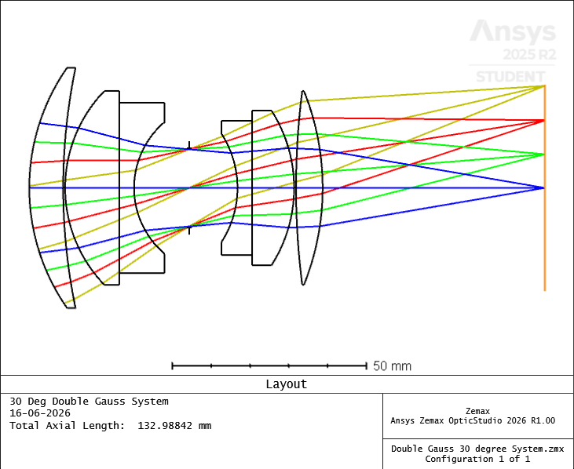

# 60° FOV Double-Gauss Imaging System: Design, Tolerance, and Thermal Analysis

An optimized 4-element industrial machine vision lens designed using Ansys Zemax OpticStudio 2026. This project bridges the gap between theoretical lens optimization, manufacturing viability (Monte Carlo yield analysis), and environmental ruggedness.

##  1. Nominal Optical Performance
* **Focal Length:** 25 mm 
* **Total Field of View (FOV):** 60° (30° Half-FOV)
* **Aperture Speed:** f/2.5

---

##  2. Manufacturing Tolerance Analysis (500-Trial Monte Carlo)
To evaluate high-volume factory yield predictability, a 500-trial Monte Carlo simulation was executed across three separate fabrication tiers. Element decenters (`TSDX/TSDY`) and element tilts (`TSTX/TSTY`) were identified as the dominant performance gatekeepers.

| Manufacturing Tier | Nominal On-Axis Spot | 90% Production Yield Spot Size | Back-Focus Focus Shift |
| :--- | :--- | :--- | :--- |
| **Loose (Commercial)** | 8.50 µm | 41.00 µm | ± 2.338 mm |
| **Medium (Precision)** | 8.50 µm | 15.00 µm | ± 0.689 mm |
| **High-Precision** | 8.50 µm | 12.00 µm | ± 0.494 mm |

**Conclusion:** The **Medium Precision Tier** represents the industrial "sweet spot," satisfying typical modern CMOS pixel grid boundaries while keeping machining assembly costs manageable.

---

##  3. Environmental Thermal Sweep (20°C vs 60°C)
The system was evaluated against an environmental delta of +40°C to simulate an unconditioned factory conveyor line environment. Microscopic thermal expansions and glass material index shifts ($\text{d}n/\text{d}T$) induce systematic thermal defocus:

* **20°C Baseline On-Axis Spot:** 8.501 µm
* **60°C Heated On-Axis Spot:** 16.592 µm (Thermal Defocus Blur Signature)
* **Off-Axis Observation:** Peripheral fields exhibit localized coma amplification up to 21.733 µm due to structural alignment symmetry loss.

---

##  How to Open the Files
1. Download the files inside the `LENS_Data_Files/` folder.
2. Open using **Ansys Zemax OpticStudio (Sequential Mode)**.
